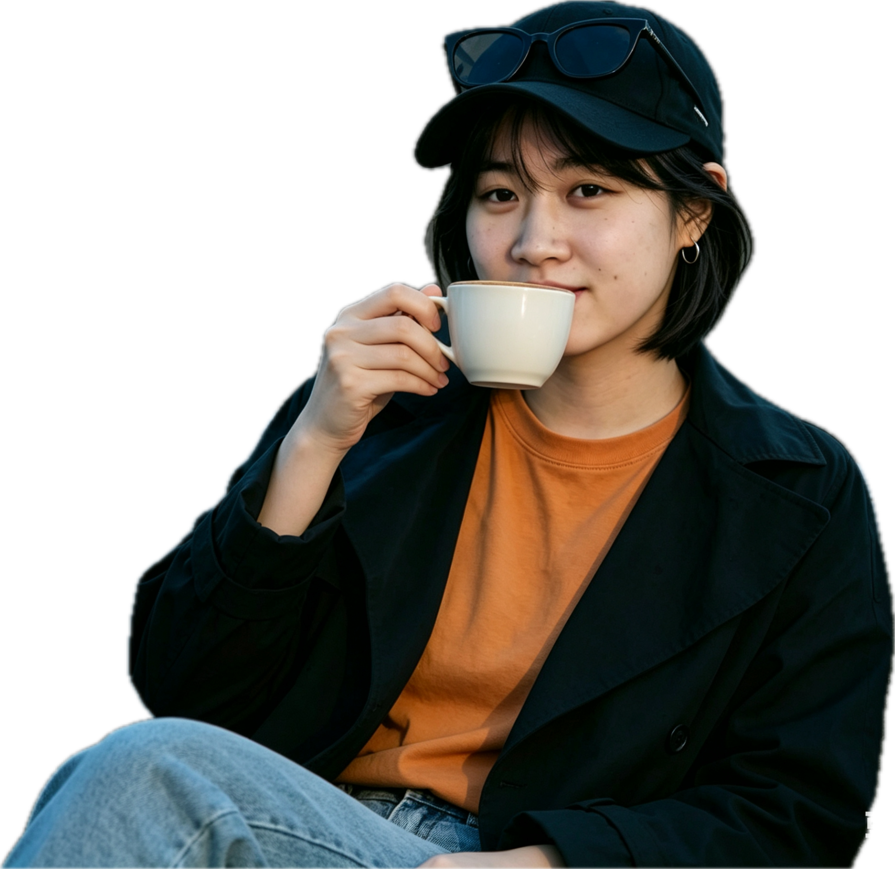
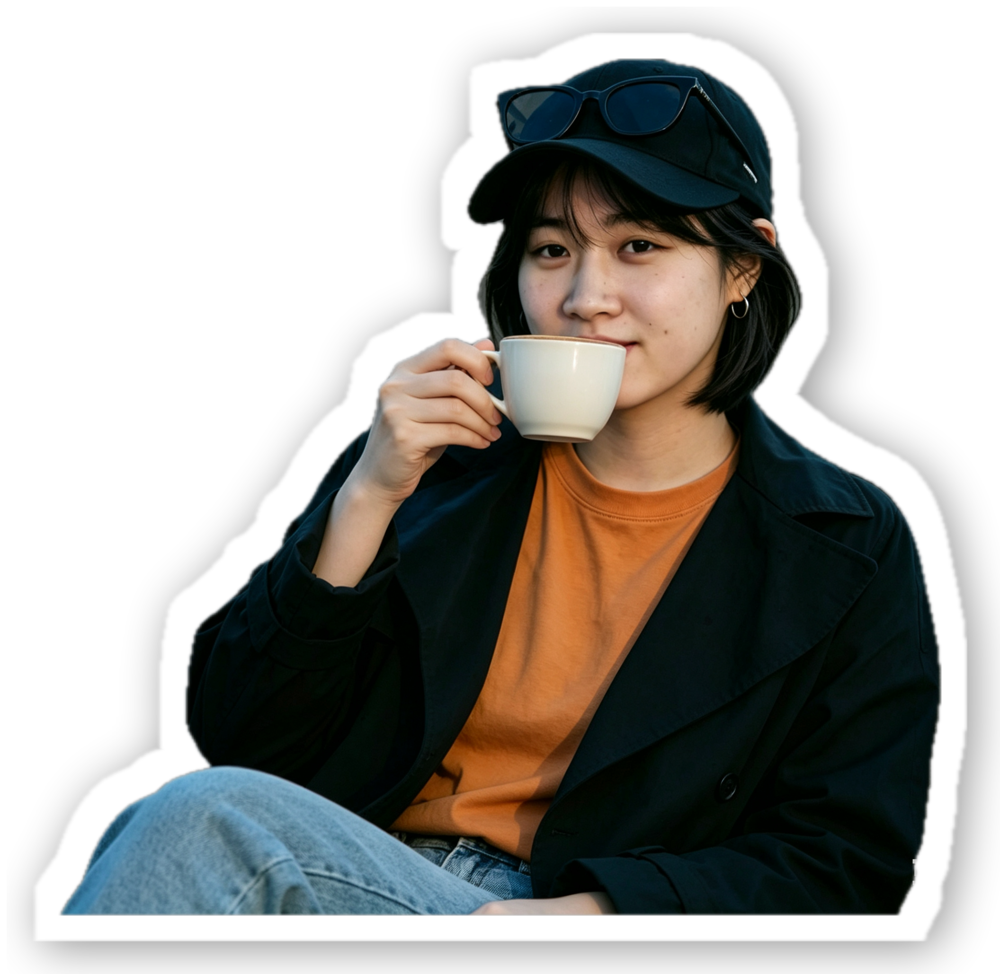

# StickerMaker

一个简单的 Python 小工具,给透明背景的 PNG 图片添加 **白色描边 + 黑色投影**,一键把普通 PNG 变成 iOS / iMessage 风格的贴纸。

不做抠图,只利用 PNG 自身的 alpha 通道。所有尺寸参数按**图片短边的百分比**计算,不同分辨率的图片产出视觉一致。

A simple Python utility that adds a **white outline + black shadow** to PNG images with transparent backgrounds, turning ordinary PNGs into iOS/iMessage-style stickers with one click. No image masking is required; it only utilizes the PNG's own alpha channel. All size parameters are calculated as a percentage of the image's shorter side, ensuring visual consistency across images of different resolutions.

## 效果预览 Effect Preview

| 原图 (透明背景 PNG) Original Image (Transparent Background PNG)| 处理后 Processed |
| :---: | :---: |
|  |  |

## 环境要求 Environmental Requirements

- Python 3.7+
- Pillow
- numpy

安装依赖 Install dependencies:

```bash
pip install Pillow numpy
```

## 使用方法 How to use

### 方式一:在 PyCharm / VS Code 里直接运行

1. 把所有要处理的 PNG 放到 `sticker_effect.py` 同一个文件夹
2. 右键 → Run,或点编辑器里的运行按钮
3. 结果出现在同目录的 `output/` 子文件夹里

### Method One: Running Directly in PyCharm / VS Code

1. Place all the PNGs to be processed in the same folder as `sticker_effect.py`

2. Right-click → Run, or click the run button in the editor

3. The results will appear in the `output/` subfolder in the same directory

### 方式二:命令行

```bash
# 处理脚本同目录下所有 PNG
python sticker_effect.py

# 处理指定文件
python sticker_effect.py input.png

# 批量
python sticker_effect.py *.png

# 单文件指定输出路径
python sticker_effect.py input.png -o mysticker.png
```
### Method Two: Command Line

```bash

# Process all PNG files in the same directory

python sticker_effect.py

# Process a specified file

python sticker_effect.py input.png

# Batch processing

python sticker_effect.py *.png

# Specify output path for a single file

python sticker_effect.py input.png -o mysticker.png

```

## 参数说明

所有尺寸默认按图片**短边的百分比**计算,保证不同分辨率图片效果一致。

| 参数 | 默认值 | 说明 |
| --- | --- | --- |
| `--outline-ratio` | `0.030` | 白边宽度占短边的比例(3%) |
| `--blur-ratio` | `0.025` | 阴影模糊半径占短边的比例 |
| `--dx-ratio` | `0.008` | 阴影水平偏移占短边的比例 |
| `--dy-ratio` | `0.008` | 阴影垂直偏移占短边的比例 |
| `--opacity` | `110` | 阴影不透明度 (0-255) |
| `--output-dir` | `output` | 输出目录 |

如需固定像素(不随图片缩放),使用绝对像素覆盖:

| 参数 | 说明 |
| --- | --- |
| `--outline-px` | 白边宽度(像素) |
| `--blur-px` | 阴影模糊半径(像素) |
| `--dx-px` / `--dy-px` | 阴影偏移(像素) |


## Parameter description

All sizes are calculated by default according to the percentage of the short side of the picture ** to ensure that the effect of the picture of different resolutions is consistent.

| Parameters | Default | Description |
| --- | --- | --- |
| `--outline-ratio` | `0.030` | White edge width as a percentage of the short side (3%) |
| `--blur-ratio` | `0.025` | Shadow blur radius as a percentage of the short side |
| `--dx-ratio` | `0.008` | Shadow horizontal offset as a percentage of the short side |
| `--dy-ratio` | `0.008` | Shadow vertical offset as a percentage of the short side |
| `--opacity` | `110` | Shadow opacity (0-255) |
| `--output-dir` | `output` | Output Directory |

If you need fixed pixels (not scaled with the picture), use absolute pixels to cover:

| Parameters | Description |
|---|---|
| `--outline-px` | White edge width (pixel) |
| `--blur-px` | Shadow blur radius (pixel) |
| `--dx-px` / `--dy-px` | Shadow offset (pixel) |

### 示例

```bash
# 白边更粗、阴影更深
python sticker_effect.py --outline-ratio 0.04 --opacity 150

# 某张图用固定像素
python sticker_effect.py IMG_0941.png --outline-px 50

# 输出到自定义目录
python sticker_effect.py --output-dir ~/Desktop/my_stickers
```

### Example

```bash
# Thicker white border, deeper shadow

python sticker_effect.py --outline-ratio 0.04 --opacity 150

# A certain image with fixed pixels

python sticker_effect.py IMG_0941.png --outline-px 50

# Output to a custom directory

python sticker_effect.py --output-dir ~/Desktop/my_stickers
```

## 输入要求

**输入必须是真正透明背景的 PNG(RGBA 模式)。** 如果 PNG 的 alpha 通道全为 255(即完全不透明,黑边其实是真实黑像素),脚本会打印警告并跳过——白边和阴影没地方画。

**怎么拿到透明背景 PNG?**

- **iOS**:打开照片 App → 长按主体自动抠图 → **拖拽**(不是复制)到"备忘录" → 长按图片"存储到照片"
- **macOS**:预览.app 可以用"即时 Alpha"工具去背景后导出 PNG
- **抠图网站**:remove.bg、Adobe Express 免费抠图等
- **Python 里**可以用 [rembg](https://github.com/danielgatis/rembg) 批量去背景

## Input requirements

**The input must be PNG (RGBA mode) with a real transparent background. ** If the alpha channel of PNG is all 255 (that is, it is completely transparent, and the black edge is actually a real black pixel), the script will print a warning and skip it - there is no place to draw white borders and shadows.

**How to get the transparent background PNG? **

- **iOS**: Open the Photos App → Long press the body to automatically key → **Drag** (not copying) to "Memo" → Long press the picture "Save to Photos"

- **macOS**: Preview.app can use the "Instant Alpha" tool to remove the background and export PNG

- **Ket website**: remove.bg, Adobe Express free key, etc.

- **In Python**, you can use [rembg](https://github.com/danielgatis/rembg) to remove the background in batches.
- 
## 项目结构 Structure

```
StickerMaker/
├── sticker_effect.py      # 主脚本 main
├── README.md
├── IMG_xxxx.png           # 待处理的 PNG PNGs pending processing
└── output/                # 处理结果(自动创建) Processing Result (Automatically Created)
    └── IMG_xxxx_sticker.png
```

## 实现原理

1. 读取 PNG 的 alpha 通道作为主体蒙版
2. 对蒙版做**形态学膨胀**(向外扩展 N 像素)→ 得到描边蒙版
3. 描边蒙版填白色 → 白边图层
4. 描边蒙版做**高斯模糊** + 偏移 + 降不透明度 → 阴影图层
5. 从下到上合成:阴影 → 白边 → 原图主体

## Implementation Principle

1. Read the PNG's alpha channel as the main mask

2. Perform **morphological dilation** (expand outward by N pixels) on the mask → obtain the outline mask

3. Fill the outline mask with white → white edge layer

4. Apply **Gaussian blur** to the outline mask + offset + reduce opacity → shadow layer

5. Composite from bottom to top: shadow → white edge → original image subject

## License

MIT
